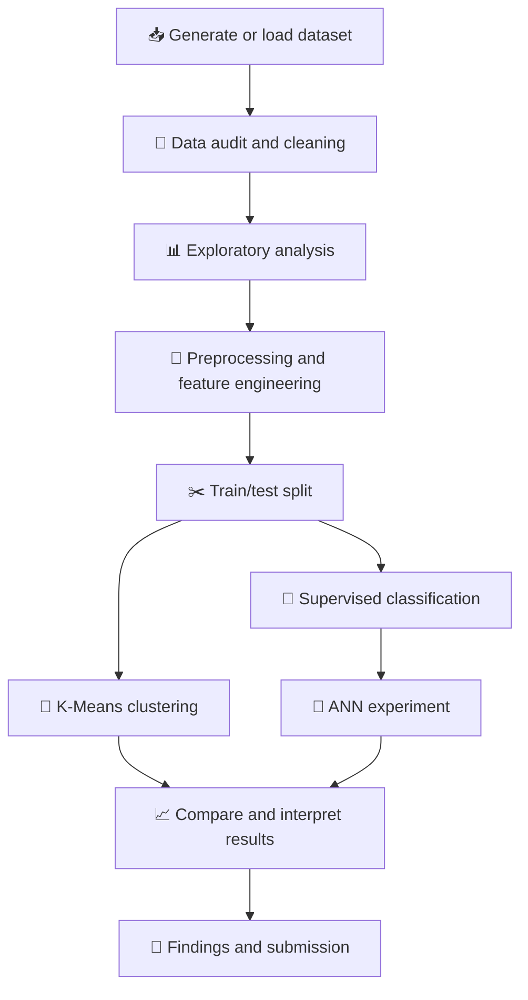
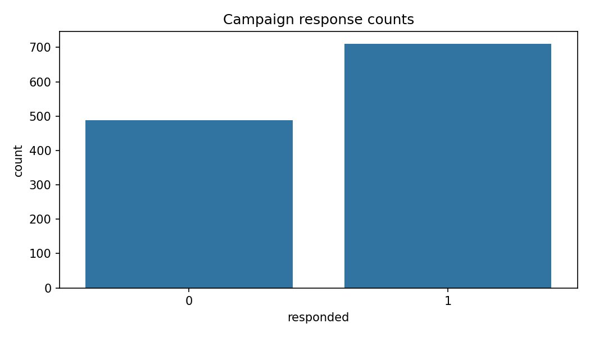
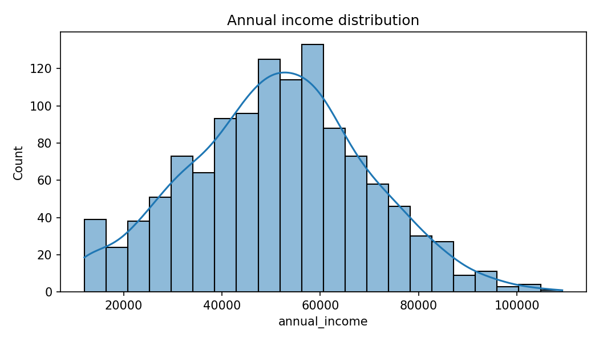
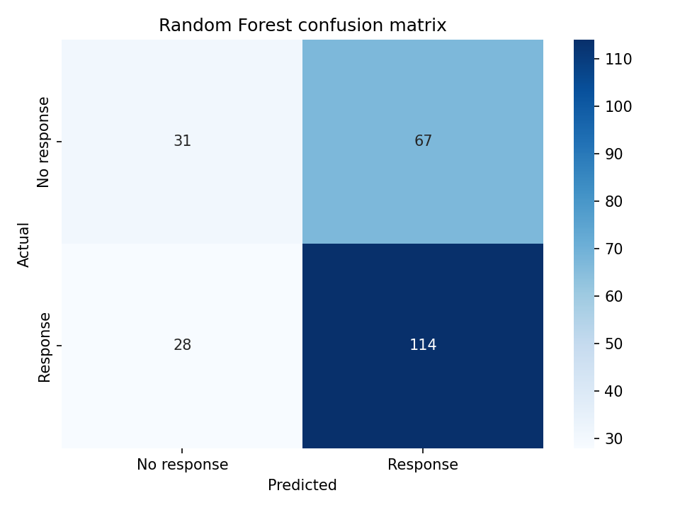
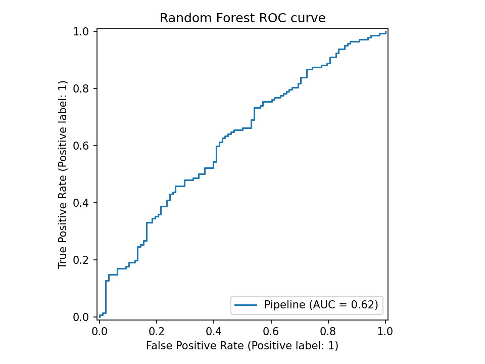
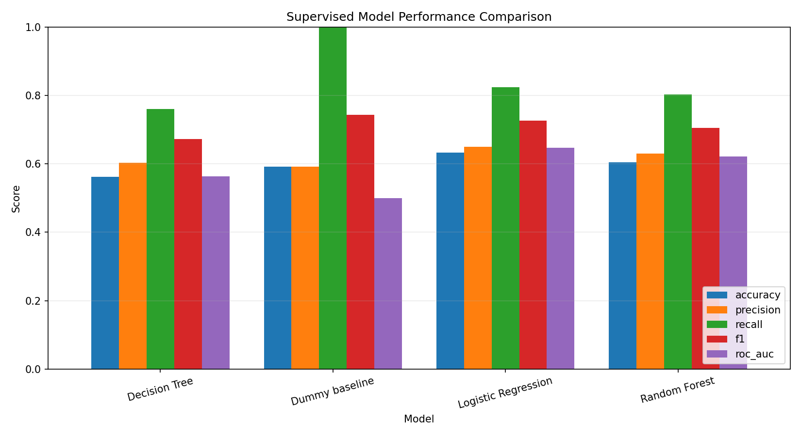
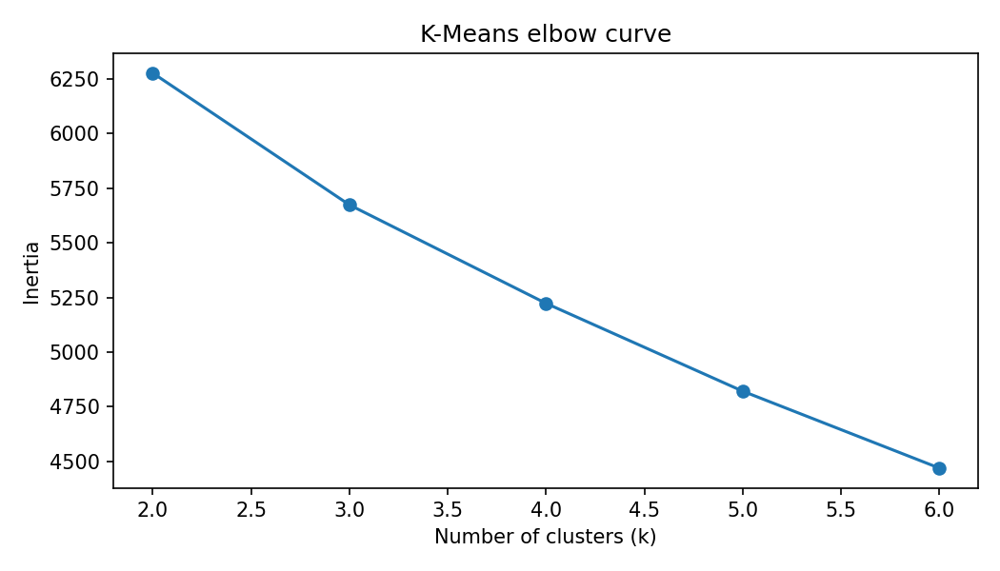
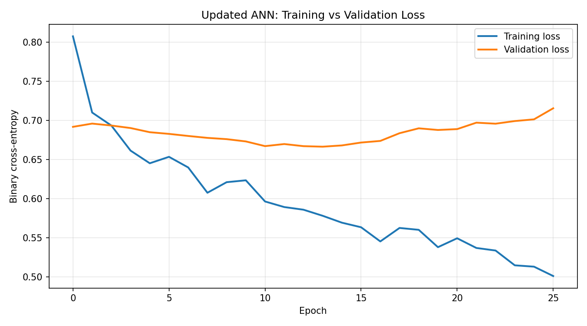

<div align="center">

# 📊 Campaign Response Prediction
### Data Science & AI/ML Practical — Set C

**Customer Analytics | Machine Learning | Deep Learning | Data Visualization**


*An end-to-end practical project to explore campaign/customer data and predict campaign response.*

</div>


## 🎥 Project Explanation Video

Watch the complete project explanation and demonstration video:

[▶️ Watch the Campaign Response Project Explanation Video](https://drive.google.com/file/d/1AG3Dc3S8T5EVJ4wCQbIajsLEFSVb1Njy/view?usp=sharing)


---

## 🌟 Project Overview

This project follows a complete data science workflow: loading and auditing data, exploring patterns with visualizations, preparing features, training machine-learning models, and evaluating predictions. It also includes K-Means clustering and an Artificial Neural Network (ANN) experiment.

> **Note:** Use the dataset and target definition required by your assignment. Report only metrics produced by running your own notebook.


## 🧭 Workflow



## 📸 Project Visualizations

The notebook saves these figures in `outputs/figures/`. The images below are linked directly to those files. Run the notebook first so the files exist.

### 1. Response Counts
Shows the number of customers in each response class.



### 2. Income Distribution
Visualizes the distribution of customer income.



### 3. Confusion Matrix
Summarizes correct and incorrect predictions by class for the evaluated model.



### 4. ROC Curve
Shows the trade-off between true-positive and false-positive rates across classification thresholds.



### 5. Model Comparison
Compares the evaluation metrics of the trained models.



### 6. K-Means Elbow Plot
Helps inspect within-cluster variation for different cluster counts.



### 7. ANN Loss Curve
Shows training and validation loss across ANN epochs.



## 🧰 Tools & Technologies

| Technology | Use |
|---|---|
| Python | Main programming language |
| Jupyter Notebook | Analysis and experiment workflow |
| pandas, NumPy | Data processing and numerical operations |
| Matplotlib, Seaborn | Data visualization |
| scikit-learn | Preprocessing, classification, clustering, and metrics |
| TensorFlow / Keras *(if installed)* | ANN experiment |

## 📂 Project Structure

```text
project-folder/
├── notebooks/
│   └── exam.ipynb
├── outputs/
│   └── figures/
│       ├── ann_loss_curve.png
│       ├── confusion_matrix.png
│       ├── income_distribution.png
│       ├── kmeans_elbow.png
│       ├── model_comparison.png
│       ├── response_counts.png
│       └── roc_curve.png
├── src/
│   └── generate_data.py
├── .gitignore
└── README.md
```

## 🚀 How to Run

### 1. Install Python

Use a Python version supported by the packages in your `requirements.txt`.

### 2. Create a virtual environment (recommended)

**Windows PowerShell**
```powershell
python -m venv .venv
.venv\Scripts\Activate.ps1
```

**macOS / Linux**
```bash
python3 -m venv .venv
source .venv/bin/activate
```

### 3. Install dependencies

```bash
pip install -r requirements.txt
```

### 4. Generate data (if your project uses the included generator)

Run this from the project root:

```bash
python src/generate_data.py
```

If your instructor supplied a dataset, use that file instead and check the notebook's data path and column names.

### 5. Run the notebook

```bash
jupyter notebook
```

Open `notebooks/exam.ipynb` and run all cells in order. After execution, confirm that the chart files listed above are present in `outputs/figures/`.

## 📈 Evaluation Metrics

The notebook may report metrics such as:

- **Accuracy:** proportion of all predictions that are correct.
- **Precision:** proportion of predicted responders who are actual responders.
- **Recall:** proportion of actual responders identified by the model.
- **F1-score:** balance between precision and recall.
- **Confusion matrix:** counts of correct and incorrect predictions for each class.
- **ROC-AUC:** measures ranking performance across classification thresholds.

When the response classes are imbalanced, accuracy alone may not describe model performance adequately. Discuss the metrics together and use the actual values from your run.

## 🧠 Methods Covered

- Data audit and exploratory data analysis
- Data preprocessing and feature preparation
- Supervised classification and model comparison
- K-Means clustering
- ANN training and loss-curve analysis
- Interpretation of evaluation metrics and visual results


<div align="center">

**Campaign Response Prediction · Data Science & AI/ML · Set C**

</div>
